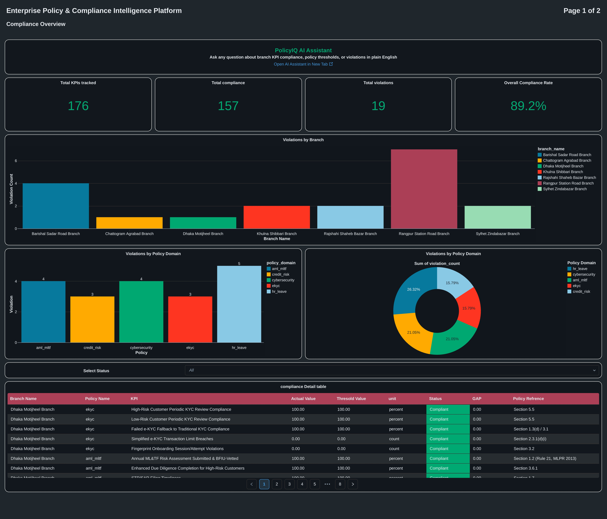

# PolicyIQ --- Enterprise Policy & Compliance Intelligence Platform

### AI-Native Banking Compliance Intelligence · Databricks · Delta Lake · Unity Catalog · AI/BI · Genie

<div align="center">


</div>

------------------------------------------------------------------------

## What is PolicyIQ?

> **PolicyIQ connects regulatory policy text with operational banking
> KPIs and turns the relationship between them into an auditable
> compliance decision.**

Banks typically maintain two disconnected information sources:

  -----------------------------------------------------------------------
  Source                              What it contains
  ----------------------------------- -----------------------------------
  Regulatory policy PDFs              Requirements, obligations,
                                      thresholds, clauses and guidance

  Branch-level KPI data               Actual operational performance by
                                      branch and reporting period
  -----------------------------------------------------------------------

The difficult part is not storing either dataset. The difficult part is
answering, reliably and repeatedly:

-   **What does the policy actually require?**
-   **Which exact clause governs the KPI?**
-   **What is the current branch-level result?**
-   **Is the result compliant?**
-   **What is the gap between the actual and the requirement?**
-   **Can every conclusion be traced back to its underlying source?**

PolicyIQ was built to close that gap.

It ingests real Bangladesh Bank regulatory documents together with
branch-level KPI data, retrieves policy language semantically, generates
dynamic SQL for arbitrary KPI questions, and presents the resulting
compliance intelligence through both a conversational AI Assistant and
an executive AI/BI Dashboard.

**Most importantly, the LLM does not decide compliance. SQL does.**

------------------------------------------------------------------------

## Executive Summary

PolicyIQ is an AI-native compliance intelligence platform designed
around a strict separation between **retrieval, querying, deterministic
computation, and explanation**.

The platform combines:

-   Regulatory policy PDFs covering e-KYC, AML/ML&TF, Credit Risk
    Management and Cybersecurity.
-   A clearly labelled synthetic internal HR Leave Policy used to
    complete the scenario.
-   Branch-level KPI measurements governed through Unity Catalog.
-   Databricks document intelligence for parsing policy PDFs.
-   AI Search / Vector Search for semantic policy retrieval.
-   Genie Space for dynamic natural-language-to-SQL over governed KPI
    data.
-   A two-tool OpenAI Agents SDK assistant.
-   A published Databricks AI/BI Dashboard with an embedded Genie
    assistant.
-   Deterministic SQL compliance facts that act as the platform's single
    source of truth.

The system was designed, built, debugged and iteratively hardened
entirely within **Databricks Free Edition**.

------------------------------------------------------------------------

## The Problem This Solves

A regulator, compliance officer or internal audit team may need to ask:

-   *"Which branches are not complying with the KYC policy?"*
-   *"Which branches violate the AML policy?"*
-   *"Does our KPI meet the requirement mentioned in the credit risk
    policy?"*
-   *"Show all violations against the policy."*
-   *"What is the average gap between actual and threshold for HR Leave
    KPIs?"*
-   *"What does the policy say about dormant accounts?"*

A conventional dashboard can show KPI values.

A conventional document search system can retrieve policy text.

But neither, by itself, closes the loop between **policy requirement →
KPI actual → deterministic comparison → traceable explanation**.

PolicyIQ is designed around that complete chain.

------------------------------------------------------------------------

## Core Design Principle

### Deterministic compliance. Probabilistic assistance.

The platform deliberately assigns different responsibilities to the data
and AI layers:

``` text
                         POLICY DOCUMENTS
                               │
                     Parse + Structure
                               │
                         Policy Chunks
                               │
                    Semantic Retrieval
                               │
                               ▼
                         AI ASSISTANT
                        /            \
                       /              \
          Policy Search                Genie
              │                         │
              │                         │
       "What does the              "What is the
        policy say?"                KPI result?"
              │                         │
              └────────────┬────────────┘
                           ▼
                 Deterministic SQL Facts
                           │
                    Compliance Verdict
                           │
                           ▼
                 Human-readable Explanation
```

**The language model retrieves, queries and explains. It does not
perform the compliance arithmetic.**

The authoritative compliance result is computed once in SQL inside
`kpi_compliance_facts`.

------------------------------------------------------------------------

# Architecture

``` text
┌─────────────────────────────────────────────────────────────────────────┐
│                         POLICY DOCUMENTS                                │
│                                                                         │
│  e-KYC · AML/ML&TF · Credit Risk · Cybersecurity · HR Leave            │
│                                                                         │
│  5 source PDFs                                                         │
└───────────────────────────────┬─────────────────────────────────────────┘
                                │
                                │ ai_parse_document
                                ▼
┌─────────────────────────────────────────────────────────────────────────┐
│                         DOCUMENT PIPELINE                               │
│                                                                         │
│  Layout-aware parsing → structured HTML → retrieval-sized chunks       │
│                                                                         │
│  ai_prep_search                                                        │
└───────────────────────────────┬─────────────────────────────────────────┘
                                │
                                ▼
┌─────────────────────────────────────────────────────────────────────────┐
│                    POLICY SEARCH / VECTOR LAYER                         │
│                                                                         │
│  Delta Sync Index                                                       │
│  Databricks-managed embeddings: databricks-gte-large-en                │
│  Citation-attributed policy chunks                                     │
└───────────────────────────────┬─────────────────────────────────────────┘
                                │
                                │ search_policy_text
                                ▼
┌─────────────────────────────────────────────────────────────────────────┐
│                           AI ASSISTANT                                  │
│                                                                         │
│                   OpenAI Agents SDK                                    │
│                                                                         │
│      ┌────────────────────────┐    ┌────────────────────────┐           │
│      │ search_policy_text      │    │ Genie as a tool        │           │
│      │ Policy retrieval        │    │ Dynamic NL → SQL       │           │
│      └────────────────────────┘    └────────────────────────┘           │
└───────────────────────────────┬─────────────────────────────────────────┘
                                │
                                │
          ┌─────────────────────┴─────────────────────┐
          │                                           │
          ▼                                           ▼
┌───────────────────────────────┐       ┌─────────────────────────────────┐
│       KPI DATA PLATFORM       │       │       COMPLIANCE FACTS          │
│                               │       │                                 │
│ Bronze → Silver Delta Lake    │       │ kpi_compliance_facts            │
│ Unity Catalog governed        │       │                                 │
│ branch_dim                    │       │ actual                          │
│ policy_registry               │       │ threshold                       │
│ kpi_registry                  │       │ comparison operator             │
│ kpi_actuals                   │       │ is_compliant                    │
└───────────────────────────────┘       │ compliance_status               │
                                        │ raw_gap                         │
                                        └────────────────┬────────────────┘
                                                         │
                                                         ▼
┌─────────────────────────────────────────────────────────────────────────┐
│                         CONSUMPTION LAYER                               │
│                                                                         │
│  Standalone Databricks App                 AI/BI Dashboard              │
│  Conversational assistant                  Compliance Overview          │
│                                              Policy & KPI Reference     │
│                                              Embedded Genie              │
└─────────────────────────────────────────────────────────────────────────┘
```

------------------------------------------------------------------------

## Architecture Decisions

  -----------------------------------------------------------------------
  Decision                            Why it matters
  ----------------------------------- -----------------------------------
  **Policy retrieval separated from   Policy language and structured KPI
  KPI querying**                      data require different retrieval
                                      strategies

  **Genie used as a tool**            KPI questions are translated into
                                      fresh SQL instead of being limited
                                      to fixed query templates

  **Compliance computed in SQL**      Prevents the LLM from becoming the
                                      source of truth for arithmetic or
                                      verdicts

  **Unity Catalog as governance       Tables, volumes, functions and
  boundary**                          permissions are governed under one
                                      catalog

  **Citation metadata retained        Policy answers remain traceable to
  through the pipeline**              source documents and exact clauses

  **Synthetic policy explicitly       Internal/synthetic content is never
  labelled**                          represented as regulatory authority

  **Single compliance facts table**   Dashboard and AI surfaces consume
                                      the same deterministic compliance
                                      results
  -----------------------------------------------------------------------

------------------------------------------------------------------------

# Databricks Components

  -----------------------------------------------------------------------
  Component                           Role in PolicyIQ
  ----------------------------------- -----------------------------------
  **Unity Catalog**                   Governs every table, volume,
                                      function and permission under the
                                      `policyiq` catalog

  **Volumes**                         Landing zone for 5 policy PDFs and
                                      4 seed KPI/registry CSVs

  **`ai_parse_document`**             Layout-aware PDF parsing that
                                      preserves text, headers and tables
                                      as structured HTML

  **`ai_prep_search`**                Converts parsed policy content into
                                      retrieval-sized,
                                      citation-attributed fragments

  **Delta Lake**                      Stores Bronze/Silver data for KPI
                                      data and parsed policy content

  **AI Search / Vector Search**       Delta Sync Index with
                                      Databricks-managed embeddings for
                                      semantic policy retrieval

  **Genie Space**                     Dynamic natural-language-to-SQL
                                      over governed Unity Catalog tables

  **Unity Catalog Functions**         Hosts `search_policy_text`, exposed
                                      as an MCP-callable tool

  **Mosaic AI / OpenAI Agents SDK**   Orchestrates policy retrieval and
                                      dynamic KPI querying

  **Databricks Apps**                 Hosts the standalone conversational
                                      assistant

  **AI/BI Dashboard**                 Executive compliance reporting and
                                      embedded AI interaction

  **SQL Warehouse --- Serverless**    Powers interactive SQL, Genie
                                      execution and dashboard rendering
  -----------------------------------------------------------------------

------------------------------------------------------------------------

# Source Documents

PolicyIQ intentionally distinguishes between **regulatory authority**
and **synthetic internal policy content**.

  -----------------------------------------------------------------------
  Document          Domain Key        Issuing Authority Status
  ----------------- ----------------- ----------------- -----------------
  Guidelines on     `ekyc`            Bangladesh Bank   Real regulatory
  Electronic Know                     --- Banking       document
  Your Customer                       Regulation and    
  (e-KYC), 2026                       Policy            
                                      Department-1      

  Money Laundering  `aml_mltf`        Bangladesh        Real regulatory
  & Terrorist                         Financial         document
  Financing Risk                      Intelligence Unit 
  Assessment                          (BFIU),           
  Guidelines for                      Bangladesh Bank   
  Banking Sector                                        

  Guidelines on     `credit_risk`     Bangladesh Bank   Real regulatory
  Credit Risk                                           document
  Management (CRM)                                      
  for Banks, 2016                                       

  Guidelines on     `cybersecurity`   Bangladesh Bank   Real regulatory
  Cybersecurity                                         document
  Framework,                                            
  Version 1.0                                           
  (2026)                                                

  HR Leave Policy   `hr_leave`        Internal / Human  **Synthetic,
  (Meridian Trust                     Resources         clearly
  Bank PLC)                           Division          labelled**
  -----------------------------------------------------------------------

The cybersecurity framework is used as the functional equivalent of an
ISO 27001-style domain because Bangladesh Bank does not itself publish
an ISO 27001 document.

The HR Leave Policy is intentionally synthetic because no financial
regulator publishes an internal HR leave policy. It exists to complete
the four-domain compliance scenario and is never presented with the same
regulatory authority as the real regulatory documents.

This distinction is represented directly in the data model through the
`is_synthetic` field.

------------------------------------------------------------------------

# Data Model

Unity Catalog structure:

``` text
policyiq
│
├── bronze
│   ├── policy_documents_raw
│   ├── policy_documents_mapped
│   ├── policy_documents_parsed
│   ├── branch_dim
│   ├── policy_registry
│   └── kpi_registry
│
├── silver
│   ├── policy_chunks
│   └── kpi_compliance_facts
│
└── gold
    └── search_policy_text
```

## Bronze Layer

The Bronze layer contains the raw and foundational data required by
downstream processing.

### `policy_documents_raw`

Raw policy document content.

### `policy_documents_mapped`

Policy documents mapped to their source metadata and domain information.

### `policy_documents_parsed`

Parsed policy content produced through document intelligence.

### `branch_dim`

8 branches across 6 divisions, including:

-   Branch type
-   Branch category
-   Employee count
-   Geographic risk classification

### `policy_registry`

One row per source document containing:

-   Document name
-   Issuing authority
-   Version
-   Effective date
-   Synthetic flag

### `kpi_registry`

22 KPIs mapped to:

-   Governing policy
-   Exact clause reference
-   Threshold
-   Comparison operator

### `kpi_actuals`

Measured KPI values by branch and reporting period.

------------------------------------------------------------------------

## Silver Layer

### `policy_chunks`

Retrieval-ready policy fragments containing full citation metadata.

These chunks are embedded and indexed for semantic search.

### `kpi_compliance_facts`

The **single authoritative compliance table**.

Every KPI actual is joined with its governing threshold and comparison
rule, producing:

-   Actual value
-   Threshold
-   Comparison operator
-   `is_compliant`
-   `compliance_status`
-   `raw_gap`

This is the table that establishes the deterministic compliance verdict.

------------------------------------------------------------------------

## Gold Layer

### `search_policy_text`

A Unity Catalog Function that provides the controlled interface into the
policy Vector Search index.

It is exposed as an MCP-callable tool to the AI Assistant.

------------------------------------------------------------------------

# Project Scale

  Metric                                  Value
  ------------------------------------- -------
  Policy source documents                     5
  Real regulatory documents                   4
  Synthetic internal policy documents         1
  Branches                                    8
  Divisions                                   6
  Tracked KPIs                               22
  Total KPI measurements                    176
  Compliant measurements                    157
  Non-compliant measurements                 19
  AI Assistant tools                          2
  Dashboard pages                             2

### Compliance Dataset

The 176 measurements represent:

``` text
8 branches × 22 KPIs = 176 KPI measurements
```

The dataset intentionally contains:

``` text
157 compliant
19 non-compliant
```

It includes one fully clean control branch and two intentionally weaker
branches whose violations concentrate in areas consistent with their
geographic risk classification.

------------------------------------------------------------------------

# AI Assistant

PolicyIQ's conversational layer is built with the **OpenAI Agents SDK**
and deployed as a Databricks App.

It has exactly **two tools**.

## 1. Genie --- Dynamic KPI / Data Intelligence

Genie is used for questions involving:

-   KPI values
-   Compliance status
-   Violations
-   Thresholds
-   Branches
-   Comparisons
-   Aggregates
-   Policy metadata

Instead of relying on a finite collection of hardcoded SQL functions,
Genie writes a fresh SQL query against the governed Unity Catalog tables
for each question.

This means the assistant's data-querying capability is bounded by the
underlying governed data rather than by a manually authored list of
anticipated question shapes.

------------------------------------------------------------------------

## 2. `search_policy_text` --- Policy Intelligence

The policy search tool is used for questions asking what the source
documents actually say.

Examples:

``` text
"What does the credit risk policy require?"
"Which clause governs this requirement?"
"What does the AML policy say about this control?"
```

The retrieved fragments retain citation metadata so the answer can be
traced to the underlying source document and clause.

------------------------------------------------------------------------

# Zero-Hardcoding Strategy

An earlier iteration used two purpose-built SQL functions with fixed
query shapes.

That design was deliberately retired.

The reason is simple:

> **A finite list of pre-written query shapes is not genuinely
> data-driven simply because it is exposed through an AI interface.**

PolicyIQ therefore uses:

``` text
User question
      │
      ▼
AI Assistant
      │
      ├──────────────► Policy question
      │                     │
      │                     ▼
      │              search_policy_text
      │
      └──────────────► KPI / data question
                            │
                            ▼
                         Genie
                            │
                            ▼
                       Fresh SQL
                            │
                            ▼
                    Unity Catalog data
```

The system can therefore answer genuinely arbitrary questions supported
by the underlying governed data.

------------------------------------------------------------------------

# Compliance Decision Model

The most important architectural rule is:

``` text
LLM ≠ Compliance Engine
```

Instead:

``` text
Policy requirement
       +
KPI actual
       +
Comparison operator
       │
       ▼
Deterministic SQL
       │
       ▼
Compliance fact
```

The AI layer then explains the result.

This prevents the language model from inventing a threshold, misapplying
an operator, or performing the final compliance arithmetic at response
time.

------------------------------------------------------------------------

# Dashboard

## Enterprise Policy & Compliance Intelligence Platform

The published AI/BI Dashboard contains **two pages** and an embedded
conversational assistant.

------------------------------------------------------------------------

## Page 1 --- Compliance Overview




**Purpose:** Provide an executive and operational view of current policy
compliance.

### Components

-   KPI tracked count
-   Compliant count
-   Violation count
-   Overall compliance rate
-   Branch-level violation bar chart
-   Policy-domain violation breakdown
-   Full color-coded compliance detail table
-   Regional risk classification breakdown

The regional-risk analysis demonstrates that the branches classified as
geographically high-risk are also the branches concentrating the most
violations.

This is an analytical finding derived from the underlying data rather
than a restatement of an AI chat response.

------------------------------------------------------------------------

## Page 2 --- Policy & KPI Reference


**Purpose:** Provide a verification surface for the claims made by the
AI Assistant.

### Components

-   Source document listing
-   Issuing authority
-   Synthetic-document distinction
-   Tracked KPI listing
-   Exact KPI threshold
-   Clause citation

This page allows a viewer to move from a compliance result back toward
the policy and KPI metadata behind it.

------------------------------------------------------------------------

## Embedded AI Assistant

The same Genie Space powering the standalone assistant is embedded
directly into the Compliance Overview page.

This gives dashboard users a live conversational interface without
leaving the reporting environment.

------------------------------------------------------------------------

# Sample Capabilities

### Compliance discovery

``` text
"Which branches are not complying with the KYC policy?"
```

``` text
"Which branches violate the AML policy?"
```

``` text
"Show all violations against the policy."
```

### KPI analysis

``` text
"Does our KPI meet the requirement mentioned in the credit risk policy?"
```

``` text
"What is the average gap between actual and threshold for HR Leave KPIs?"
```

The second example demonstrates that the assistant is capable of
producing an aggregate answer dynamically rather than retrieving a
precomputed response.

### Policy-grounded questions

``` text
"What does the policy say about dormant accounts?"
```

When the subject is not addressed by the available source documents,
PolicyIQ explicitly responds that it is **not addressed in the available
policy documents** rather than fabricating a plausible answer.

### Source authority questions

``` text
"Which real Bangladesh Bank policy documents are in the system?"
```

The system correctly distinguishes the real regulatory documents from
the synthetic HR Leave Policy.

------------------------------------------------------------------------

# Engineering Principles

## 1. The LLM never performs arithmetic judgment

Compliance status is computed once, deterministically, in SQL.

------------------------------------------------------------------------

## 2. Every citation is traceable

Policy claims are connected to source-document metadata and exact clause
references.

No threshold is intended to exist without a documented derivation.

The project also transparently distinguishes cases where a numeric
threshold was reasonably inferred from a qualitative regulatory
obligation rather than read verbatim.

------------------------------------------------------------------------

## 3. Honesty over plausibility

If the available policy documents do not address a subject, the system
is designed to say so.

This behavior was explicitly validated using the dormant-accounts
question.

------------------------------------------------------------------------

## 4. No pre-anticipated question set

The assistant's scope is defined by the governed data and policy corpus
rather than a finite set of hardcoded query functions.

------------------------------------------------------------------------

## 5. One source of truth

The standalone App, dashboard and embedded Genie experience rely on the
same governed data foundation.

The deterministic compliance facts therefore remain consistent across
consumption surfaces.

------------------------------------------------------------------------

## 6. Regulatory authority is explicit

Real regulatory documents and synthetic internal documents are
represented differently in the data model.

The system does not silently elevate synthetic content to regulatory
authority.

------------------------------------------------------------------------

# Data & Compliance Lineage

A complete PolicyIQ answer follows this conceptual lineage:

``` text
Source PDF
   │
   ▼
ai_parse_document
   │
   ▼
Parsed policy content
   │
   ▼
ai_prep_search
   │
   ▼
Policy chunk + citation metadata
   │
   ▼
Vector Search
   │
   ▼
Policy retrieval
   │
   ├──────────────────────────────┐
   │                              │
   ▼                              ▼
Policy requirement          KPI registry / actuals
                                  │
                                  ▼
                         kpi_compliance_facts
                                  │
                                  ▼
                         Deterministic verdict
                                  │
                                  ▼
                         AI explanation
```

This lineage is central to the platform's auditability.

------------------------------------------------------------------------

# Technology Stack

  Layer                          Technology
  ------------------------------ --------------------------------------
  Platform                       Databricks Free Edition
  Governance                     Unity Catalog
  Storage                        Delta Lake
  Document Intelligence          `ai_parse_document`
  Search Preparation             `ai_prep_search`
  Semantic Search                Databricks AI Search / Vector Search
  Embeddings                     `databricks-gte-large-en`
  Natural Language Querying      Databricks Genie Space
  Agent Orchestration            Mosaic AI / OpenAI Agents SDK
  Application                    Databricks Apps
  Dashboard                      Databricks AI/BI Dashboard
  Query Engine                   Serverless SQL Warehouse
  Data Language                  SQL
  Application / Agent Language   Python

------------------------------------------------------------------------

# Repository Structure

The project is organized around the major platform layers and
consumption surfaces:

``` text
policyiq/
│
├── README.md
│
├── policy_documents/
│   └── source regulatory and internal policy PDFs
│
├── data/
│   └── KPI and registry seed data
│
├── notebooks/
│   ├── document parsing
│   ├── policy preparation
│   ├── KPI ingestion
│   ├── compliance fact generation
│   └── validation
│
├── app/
│   └── standalone AI Assistant
│
└── dashboard/
    └── AI/BI Dashboard assets and references
```

> The repository structure above represents the logical organization of
> the platform. The authoritative implementation remains the Databricks
> workspace, Unity Catalog objects and deployed application.

------------------------------------------------------------------------

# How the Platform Runs

## Step 1 --- Land source documents and seed data

The source policy PDFs and KPI/registry data are placed into governed
Databricks Volumes.

------------------------------------------------------------------------

## Step 2 --- Parse policy documents

`ai_parse_document` converts the PDFs into structured, layout-aware
content.

The goal is to preserve meaningful document structure such as:

-   Text
-   Headers
-   Tables

------------------------------------------------------------------------

## Step 3 --- Prepare policy chunks

`ai_prep_search` converts the parsed content into retrieval-sized
fragments while retaining citation metadata.

------------------------------------------------------------------------

## Step 4 --- Build the policy search index

The policy chunks are stored in Delta Lake and synchronized into the
Vector Search index using Databricks-managed embeddings.

------------------------------------------------------------------------

## Step 5 --- Build KPI compliance facts

Branch dimensions, policy metadata, KPI definitions and actual KPI
measurements are combined into the deterministic compliance layer.

The resulting `kpi_compliance_facts` table contains the authoritative
compliance result.

------------------------------------------------------------------------

## Step 6 --- Configure Genie

The governed Unity Catalog KPI tables are exposed through a Genie Space.

Genie dynamically translates natural-language questions into SQL.

------------------------------------------------------------------------

## Step 7 --- Deploy the AI Assistant

The OpenAI Agents SDK orchestrates:

``` text
Policy question → search_policy_text

KPI/data question → Genie

Combined reasoning → retrieved evidence + governed data
```

The assistant is deployed as a Databricks App.

------------------------------------------------------------------------

## Step 8 --- Publish the Dashboard

The AI/BI Dashboard presents:

``` text
Compliance Overview
Policy & KPI Reference
Embedded Genie Assistant
```

All surfaces remain connected to the same governed data foundation.

------------------------------------------------------------------------

# Validation & Reliability

PolicyIQ was designed with explicit validation around the most important
failure modes.

  Validation Area                           Expected Behaviour
  ----------------------------------------- -------------------------------------------------
  KPI compliance calculation                Deterministic SQL result
  Policy retrieval                          Source-grounded policy text
  Clause attribution                        Exact citation metadata
  Unsupported policy topic                  Explicitly reported as not covered
  Synthetic policy                          Clearly distinguished from regulatory documents
  Aggregate KPI question                    Dynamically calculated through Genie
  Dashboard numbers                         Consistent with governed compliance facts
  Real vs synthetic source identification   Correctly separated

------------------------------------------------------------------------

# Current Limitations

Technical transparency is a first-class part of the project.

### 1. KPI actuals are demonstration data

KPI actuals are currently hand-constructed for demonstration.

They are not yet calculated from lower-grain operational data such as:

-   Customer-level KYC records
-   Loan-level ledgers
-   Leave-application logs

The architecture supports this extension, but it has not yet been
implemented.

------------------------------------------------------------------------

### 2. Some branch attributes are not active compliance rules

Geographic and categorical branch attributes such as
`region_risk_classification` are captured in the data model but are not
yet wired into an active compliance rule.

They are currently used for analytical breakdown and validation.

------------------------------------------------------------------------

### 3. Standalone App multi-turn limitation

The standalone chat App has a known multi-turn conversation limitation
caused by a scaffold-level response-serialization gap between the chat
frontend and the OpenAI Agents SDK.

A fix has been identified and is in the process of being deployed.

The embedded dashboard Genie widget is not affected by this limitation.

------------------------------------------------------------------------

# Roadmap

The current architecture creates a direct path toward a more
production-oriented compliance platform.

``` text
Current
  │
  ├── Policy PDFs
  ├── KPI seed data
  ├── Deterministic compliance facts
  ├── Vector policy retrieval
  ├── Dynamic Genie SQL
  └── AI/BI compliance dashboard
       │
       ▼
Next
  │
  ├── Lower-grain operational KPI sources
  ├── Automated KPI computation
  ├── Expanded policy corpus
  ├── More compliance domains
  └── Fully hardened conversational state
```

The roadmap is intentionally grounded in the current limitations rather
than introducing unsupported capabilities.

------------------------------------------------------------------------

# What Makes PolicyIQ Different

PolicyIQ is not simply:

``` text
PDF → Chatbot
```

and it is not simply:

``` text
KPI → Dashboard
```

It is:

``` text
                    POLICY
                      │
                Exact requirement
                      │
                      ▼
                Semantic search
                      │
                      │
                      ├───────────────┐
                      │               │
                      ▼               ▼
                 Policy text      KPI definition
                                      │
                                      ▼
                                  KPI actual
                                      │
                                      ▼
                             Deterministic SQL
                                      │
                                      ▼
                              Compliance verdict
                                      │
                                      ▼
                             AI explanation
                                      │
                                      ▼
                         Executive dashboard
```

The value is created by connecting these layers without allowing the
language model to become the compliance authority.

------------------------------------------------------------------------

# Skills Demonstrated

``` text
Data Engineering
├── Medallion Architecture
├── Delta Lake
├── Unity Catalog
├── Data modelling
├── Data quality and validation
├── SQL-based deterministic computation
└── Governed data access

AI / Data Intelligence
├── Document intelligence
├── Semantic search
├── Vector Search
├── Databricks-managed embeddings
├── Natural-language-to-SQL
├── Genie Space
├── OpenAI Agents SDK
└── MCP-callable Unity Catalog Functions

Compliance Engineering
├── Policy-to-KPI mapping
├── Clause-level traceability
├── Deterministic compliance evaluation
├── Compliance gap analysis
├── Regulatory vs synthetic source separation
└── Unsupported-question handling

Analytics Engineering
├── KPI compliance modelling
├── Branch-level analysis
├── Policy-domain analysis
├── Risk-classification analysis
└── Executive AI/BI dashboard design

Application Engineering
├── Databricks Apps
├── Conversational AI
├── Tool orchestration
└── Embedded Genie experience
```

------------------------------------------------------------------------

# Author

**Raihan Kabir**\
Associate Data Engineer · Zylo

Designed, built, debugged and iteratively hardened the PolicyIQ platform
end-to-end --- from source document ingestion and Unity Catalog
architecture through document intelligence, semantic search,
deterministic compliance modelling, dynamic natural-language querying,
conversational AI orchestration and executive AI/BI reporting.

Built entirely within the constraints of **Databricks Free Edition**.

------------------------------------------------------------------------

# Project Philosophy

> **Compliance intelligence should be explainable, traceable and
> deterministic at its core --- even when the interface is powered by
> AI.**

PolicyIQ is built around that principle.

``` text
Retrieve the policy.
Query the data.
Compute the verdict deterministically.
Explain the result.
Trace it back to the source.
```

------------------------------------------------------------------------

::: {align="center"}
**Built with Databricks · Delta Lake · Unity Catalog · AI Search · Genie
· OpenAI Agents SDK**

*Enterprise Policy & Compliance Intelligence --- from policy text to
auditable KPI decisions.*
:::
